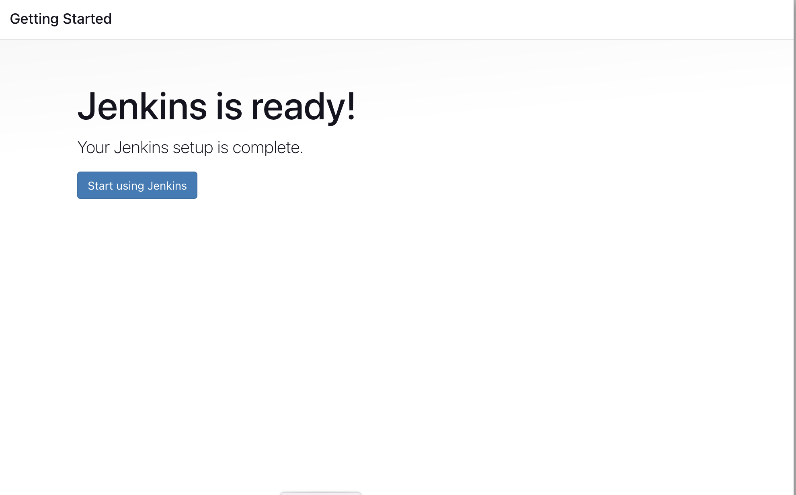

# Jenkins-CICD


## Installation on Azure Instance


## Docker  Intallalation

Run the below command to Install Docker

```
sudo apt update
sudo apt install docker.io
```

### Install Jenkins.

```
 docker run -d -p 8080:8080 -v jenkins_home:/var/jenkins_home --name jenkins-container unpluggedkk/jenkins-with-data:v3
```

**Note: ** By default, Jenkins will not be accessible to the external world due to the inbound traffic restriction by Azure. Open port 8080 in the inbound traffic rules as show below.

- Add inbound traffic rules as shown in the image (you can just allow TCP 8080).


### Login to Jenkins using the below URL:

http://<Azure-VM-public-ip-address>:8080    [You can get the address from your Azure console page]
  
After you login to Jenkins, 
      - Run the command to copy the Jenkins Admin Password - `sudo cat /var/lib/jenkins/secrets/initialAdminPassword`
      - Enter the Administrator password
      


### Click on Install suggested plugins


Wait for the Jenkins to Install suggested plugins


Create First Admin User or Skip the step [If you want to use this Jenkins instance for future use-cases as well, better to create admin user]


Jenkins Installation is Successful. You can now starting using the Jenkins 



## Install the Docker Pipeline plugin in Jenkins:

   - Log in to Jenkins.
   - Go to Manage Jenkins > Manage Plugins.
   - In the Available tab, search for "Docker Pipeline".
   - Select the plugin and click the Install button.
   - Restart Jenkins after the plugin is installed.
   


Wait for the Jenkins to be restarted.


## Docker Slave Configuration

Run the below command to Install Docker

```
sudo apt update
sudo apt install docker.io
```
 
### Grant Jenkins user and Ubuntu user permission to docker deamon.

```
sudo su - 
usermod -aG docker jenkins
usermod -aG docker kishore
systemctl restart docker
```

Once you are done with the above steps, it is better to restart Jenkins.

```
http://<azure-vm-public-ip>:8080/restart
```

The docker agent configuration is now successful.

Install Jenkins, configure Docker as agent, set up cicd, deploy applications to k8s and much more.

# Spring Boot based Java web application
 
This is a simple Sprint Boot based Java application that can be built using Maven. Sprint Boot dependencies are handled using the pom.xml 
at the root directory of the repository.

This is a MVC architecture based application where controller returns a page with title and message attributes to the view.

## Execute the application locally and access it using your browser

Checkout the repo and move to the directory

```
git clone https://github.com/unplugged-kk/DevopsWKishore/CICD/Jenkins/java-maven-sonar-argocd-helm-k8s/sprint-boot-app
cd java-maven-sonar-argocd-helm-k8s/sprint-boot-app
```

Execute the Maven targets to generate the artifacts

```
mvn clean package
```

The above maven target stroes the artifacts to the `target` directory. You can either execute the artifact on your local machine
(or) run it as a Docker container.

** Note: To avoid issues with local setup, Java versions and other dependencies, I would recommend the docker way. **


### Execute locally (Java 11 needed) and access the application on http://localhost:8080

```
java -jar target/spring-boot-web.jar
```

### The Docker way

Build the Docker Image

```
docker build -t ultimate-cicd-pipeline:v1 .
```

```
docker run -d -p 8010:8080 -t ultimate-cicd-pipeline:v1
```

Hurray !! Access the application on `http://<ip-address>:8010`


## Next Steps

### Configure a Sonar Server locally
## For more details navigate to sonarqube-containerapp-azure dir

```
Dockerfile

# Use the official SonarQube image as the base
FROM sonarqube:8.9.2-community

# Set the user
USER sonarqube

# Create data directory as a Docker volume
VOLUME /opt/sonarqube/data

# Expose the SonarQube port
EXPOSE 9000

# Define the entry point script
COPY entrypoint.sh /entrypoint.sh
#RUN chmod +x /entrypoint.sh
ENTRYPOINT ["/entrypoint.sh"]

```

## To build  and run the Docker image, use the following command:
```
docker build -t sonarqube-with-data .

docker run -d -p 9000:9000 -v sonarqube_data:/opt/sonarqube/data --name sonar-container unpluggedkk/sonarqube-with-data:v1

```

Hurray !! Now you can access the `SonarQube Server` on `http://<ip-address>:9000` 

## ArgoCD installtion 

we will use GKE to deploy agrocd. minikube also can be used this is step is done to check realworld scenario.

```
git clone https://github.com/unplugged-kk/managed-k8s

cd  GKE/regional-cluster

./create-cluster.sh to create gke cluster

```

To save cloud cost you can scaleup and down cluster based on the testing time

use below script

```
GKE/scale_cluster.sh 
```

Installation and Configuration Steps

```
kubectl create namespace argocd
kubectl apply -n argocd -f https://raw.githubusercontent.com/argoproj/argo-cd/stable/manifests/install.yaml
kubectl patch svc argocd-server -n argocd -p '{"spec": {"type": "LoadBalancer"}}'
kubectl -n argocd get secret argocd-initial-admin-secret -o jsonpath="{.data.password}" | base64 -d; echo

```

Login to argocd by `http://<LB-ip-address>:80` use admin as username and password from K8S secret.
